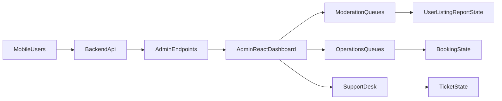

# RentHubIndia Admin Dashboard Scope

## Product Context Anchors
- Backend source of truth for admin APIs and business entities is in [D:/RentHubIndia/RentHubIndia_Backend/src/modules/admin/admin.routes.js](D:/RentHubIndia/RentHubIndia_Backend/src/modules/admin/admin.routes.js), [D:/RentHubIndia/RentHubIndia_Backend/src/modules/admin/admin.service.js](D:/RentHubIndia/RentHubIndia_Backend/src/modules/admin/admin.service.js), and [D:/RentHubIndia/RentHubIndia_Backend/prisma/schema.prisma](D:/RentHubIndia/RentHubIndia_Backend/prisma/schema.prisma).
- Mobile user journeys that generate admin workload are defined by listing/booking/chat/support/report flows in [D:/RentHubIndia/RentHubIndia_mobile/renthubindia/lib/presentation](D:/RentHubIndia/RentHubIndia_mobile/renthubindia/lib/presentation) and endpoint contracts in [D:/RentHubIndia/RentHubIndia_mobile/renthubindia/API_DOCS.md](D:/RentHubIndia/RentHubIndia_mobile/renthubindia/API_DOCS.md).
- Operational expectations and policy intent are documented in [D:/RentHubIndia/RentHubIndia_Backend/README.md](D:/RentHubIndia/RentHubIndia_Backend/README.md), [D:/RentHubIndia/RentHubIndia_Backend/API_DOCS.md](D:/RentHubIndia/RentHubIndia_Backend/API_DOCS.md), and [D:/RentHubIndia/RentHubIndia_mobile/renthubindia/renthubindia-flutter.md](D:/RentHubIndia/RentHubIndia_mobile/renthubindia/renthubindia-flutter.md).

## Must-Have Admin Modules (Phase 1)
- **Dashboard Overview**
  - KPI cards: total users, listings, bookings, open reports, pending verifications, open support tickets.
  - Trend widgets (7/30 day): new users, new listings, booking completion/cancellation rate.
  - Queue widgets: “Needs Action” (pending listing approvals, open abuse reports, open tickets).
- **User Management**
  - User directory with search/filter (role, verification status, blocked state, signup date).
  - User profile panel with activity snapshot (listings count, bookings as renter/owner, reports against user).
  - Actions: block/unblock, verify/unverify (or reject with note once backend supports).
- **Listing Moderation**
  - Listing queue by status (`isApproved`, lifecycle status, report count).
  - Review UI with images/details/owner history.
  - Actions: approve/reject/remove listing; bulk approval for low-risk categories.
- **Booking Operations**
  - Booking table by status (`PENDING`, `ACCEPTED`, `COMPLETED`, `CANCELLED`) and timeframe.
  - Detail timeline showing listing, renter, owner, notes, and related report/ticket links.
  - Read-only in Phase 1, with future admin override actions once backend endpoints exist.
- **Reports & Trust/Safety**
  - Unified report queue with filters by target type and category.
  - Case detail with reporter, target entity preview, evidence, and action notes.
  - Actions: set status (`REVIEWED`/`RESOLVED`), add moderation note, trigger linked user/listing actions.
- **Support Tickets**
  - Ticket inbox with SLA sorting (oldest open first).
  - Ticket detail with requester profile and issue history.
  - Actions: reply, update status (open/in progress/resolved/closed where available).
- **Category Management**
  - Category CRUD with safeguards (confirm destructive operations, dependency warnings).
- **Review Moderation**
  - Review list with abusive-content flags and booking linkage.
  - Actions: delete review and show audit reason.

## Required Cross-Cutting Capabilities
- **RBAC & Admin Auth**
  - Support at least `SUPER_ADMIN` and `MODERATOR` in frontend permission matrix (even if backend currently has `ADMIN` only).
  - Guard routes/components/actions by capability flags.
- **Audit Trail (frontend-visible)**
  - Every admin action captures actor, entity, previous/new state, reason, timestamp.
  - Start with client-side event logging hooks and API-ready payload shape.
- **Advanced Filters & Saved Views**
  - Column filters, date ranges, quick chips (`Open`, `Pending Approval`, `Blocked Users`), export CSV.
- **Notifications inside Admin**
  - In-app alerts for queue spikes and newly created high-severity reports.

## Backend Gap Backlog (Phase 1.5)
- Add reject/reason flow for user verification and listing moderation.
- Add admin booking intervention endpoints (force-cancel/resolve dispute).
- Add explicit report linkage for `MESSAGE` targets.
- Add persistent admin action log endpoint.
- Standardize support ticket workflow states (`OPEN -> IN_PROGRESS -> RESOLVED -> CLOSED`).
- Resolve policy mismatch around listing auto-approval vs moderation gate.

## Phase 2 Modules (High Value)
- **Finance & Payouts Ops** (when payment flows are added): transactions, fees, refunds, payouts, reconciliation.
- **Messaging Moderation Console**: flagged chat content, message takedown controls, abuse patterns.
- **Broadcast & Campaigns**: admin announcements/push templates with delivery metrics.
- **Deeper Analytics**: cohort retention, conversion funnel, geographic demand, cancellation reasons.

## Suggested Information Architecture (React Admin)
- Sidebar groups:
  - Overview
  - Operations (Users, Listings, Bookings)
  - Trust & Safety (Reports, Reviews, Verification)
  - Support
  - Catalog (Categories)
  - Settings (Admins, Roles, Audit Logs)

## Implementation Priorities for Fast Delivery
- Build list/detail/action pattern reusable across Users/Listings/Reports/Tickets.
- Implement shared table/query framework first (pagination, sorting, filters, search).
- Integrate existing `/api/admin/*` endpoints before creating new backend work.
- Add feature flags for modules depending on not-yet-built backend endpoints.

## Architecture View

## Definition of Done for v1
- All Phase 1 modules are usable with real data and protected by role-based UI permissions.
- Admin can complete end-to-end workflows: verify/block users, moderate listings, resolve reports, respond to support tickets, manage categories.
- Dashboard surfaces live queue health and key KPIs without manual SQL checks.
- Action confirmations and reason capture exist for every destructive or state-changing operation.